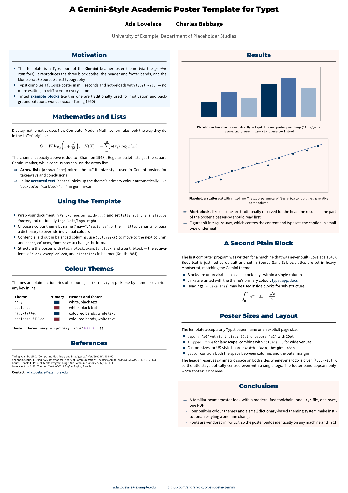
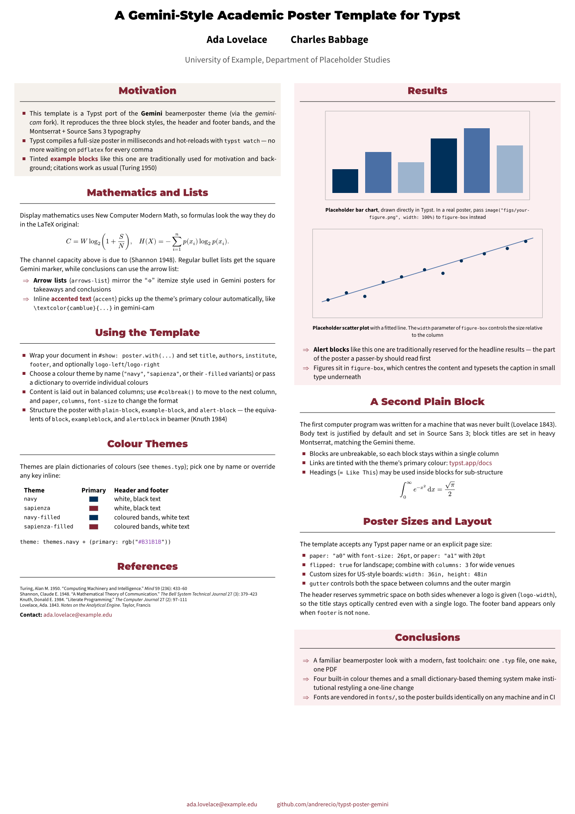

# typst-poster-gemini — academic poster template for Typst

[](https://github.com/andrerecio/typst-poster-gemini/actions/workflows/build.yml)
[](https://typst.app)
[](LICENSE)

A [Typst](https://typst.app) port of the [Gemini](https://github.com/anishathalye/gemini) beamerposter
theme (via the [gemini-cam](https://github.com/andiac/gemini-cam) fork): clean two-column academic
posters with white, tinted "example" and tinted "alert" blocks, a colour-theme system and vendored
fonts so that the poster compiles identically on any machine — no `fontspec`, no `latexmk`, no
20-second builds.

| `theme: "navy"` | `theme: "sapienza"` |
|:--:|:--:|
|  |  |


## Quick start

```bash
# 1. Get Typst (https://github.com/typst/typst/releases, or `brew install typst`)
# 2. Clone / use this repository as a template on GitHub
git clone https://github.com/andrerecio/typst-poster-gemini my-poster && cd my-poster

# 3. Build
make            # -> poster.pdf
make watch      # live preview, recompiles on every save
make preview    # PNGs in preview/ (navy + sapienza, used in this README)
```

Or without `make`:

```bash
typst compile --font-path fonts poster.typ
```

> The `--font-path fonts` flag is what makes the vendored fonts visible to Typst. In the Typst web
> app, upload the `fonts/` folder to the project instead.

## Writing a poster

`poster.typ` is a complete, self-contained example: it exercises every block type, maths, citations
and Typst-drawn placeholder figures (no image files needed). Copy it and replace the content.
The structure is:

```typst
#import "lib.typ": *

#show: poster.with(
  title:     [Your title],
  authors:   [Ada Lovelace #h(2em) Charles Babbage],
  institute: [Some University],
  footer:    [#link("mailto:ada@example.org")[ada\@example.org]],
  logo-left: image("logos/your-logo.png", height: 3.2cm),      // optional
  theme:     "navy",     // "navy" | "sapienza" | "navy-filled" | "sapienza-filled"
  paper:     "a1",       // any Typst paper name, or width:/height: for custom sizes
  columns:   2,
  font-size: 20pt,
)

#example-block[Motivation][ ... ]      // tinted block
#plain-block[Method][ ... ]            // white block, rule under the title
#alert-block[Takeaways][ ... ]         // tinted block (different tint)

#colbreak()                            // start the next column

#alert-block[Results][
  #figure-box(image("figs/result.png", width: 100%), caption: [*What the figure shows*])
  #arrows-list[first conclusion][second conclusion]   // "⇒" bullets
]
```

### Blocks and helpers (`lib.typ`)

| Function | Purpose |
|---|---|
| `poster(...)[body]` | Page size, fonts, header (title / authors / institute / logos), footer, columns |
| `plain-block(title)[body]` | White block with a thin rule under the title (`\begin{block}`) |
| `example-block(title)[body]` | Tinted block, e.g. motivation / background (`exampleblock`) |
| `alert-block(title)[body]` | Tinted block, e.g. results / takeaways (`alertblock`) |
| `figure-box(img, caption:, width:)` | Centred figure with a small caption, `width` relative to the column |
| `arrows-list[..][..]` | Bullet list with "⇒" markers in the theme colour |
| `accent[text]` | Text in the theme's primary colour (`\textcolor{camblue}{}`) |

Standard Typst markup works inside blocks: `- item` lists, `$ ... $` maths, `*bold*`, `_italic_`,
`@key` citations, `= Heading` for sub-headings.

### Poster size and columns

`paper` accepts any Typst paper name (`"a0"`, `"a1"`, `"a2"`, …); add `flipped: true` for landscape.
For imperial sizes pass `width: 36in, height: 48in` instead. Then adjust `font-size` (20pt is right
for A1; ~26pt for A0) and `columns` (2 for portrait, 3 for landscape). `gutter` sets both the
column gap and the outer margin, as a fraction of the page width.

### References

The bibliography is loaded but not printed, like `\nobibliography` in the original:

```typst
#show bibliography: none
#bibliography("refs.bib", style: "chicago-author-date")
```

Cite in the text with `@key` (renders as "Author (Year)") and print full entries anywhere with
`#cite(<key>, form: "full")` — the equivalent of `\bibentry`. Any CSL style name accepted by Typst
can be used.

## Themes and colours

Themes live in `themes.typ`. Each one is a dictionary with the same keys (primary colour, header
background/foreground, tints of the example/alert blocks, footer, …):

| Theme | Primary | Header |
|---|---|---|
| `navy` | `#00305A` | white background, dark text (the original gemini-cam look) |
| `sapienza` | `#822433` "rosso Sapienza" (Pantone 202 C) | white background, dark text |
| `navy-filled` | `#00305A` | coloured band, white text — use with a white/negative logo |
| `sapienza-filled` | `#822433` | coloured band, white text — use with a white/negative logo |

To create your own theme, copy one of the dictionaries in `themes.typ`, or override single keys
inline:

```typst
#show: poster.with(theme: (primary: rgb("#006400"), example-bg: rgb("#F0FFF0")), ...)
```

Missing keys fall back to the `navy` theme.

## Fonts

| Role | Font | Notes |
|---|---|---|
| Titles, block titles | **Montserrat** ExtraBold/Black | same family as the original LaTeX poster |
| Body | **Source Sans 3** | a text face that stays readable at 20pt+ on long paragraphs |
| Maths | **New Computer Modern Math** | bundled with Typst; matches Latin Modern from LaTeX |

All font files are in `fonts/` under the SIL Open Font License (see the licence files there).
To use different fonts, drop the `.ttf`/`.otf` files into `fonts/` and pass
`body-font: "…"`, `title-font: "…"`, `math-font: "…"` to `poster()`. `make fonts` lists what Typst
can see.

## Repository layout

```
.
├── lib.typ            # the template (blocks, header, footer, page setup)
├── themes.typ         # colour themes
├── poster.typ         # example poster (placeholder content + drawn figures) — copy and edit
├── refs.bib           # example bibliography
├── fonts/             # vendored OFL fonts + licences
├── preview/           # PNG renders for this README
├── Makefile           # make / make watch / make preview
├── typst.toml         # package manifest (for a future Typst Universe release)
└── .github/workflows/build.yml   # CI: compiles the PDF and uploads it as an artifact
```

## Continuous integration

Every push to `main` (and every pull request) compiles the poster and uploads `poster.pdf` as a
workflow artifact, so a broken build is caught before the printer does.

## Roadmap

- [ ] `template/` folder + `[template]` section in `typst.toml` for a Typst Universe release
- [ ] Optional QR-code block (paper / repo link)
- [ ] Three-column landscape example (A0)
- [ ] Optional Quarto wrapper (`quarto-ext` format) for executable chunks

## Credits and licence

MIT, see [LICENSE](LICENSE). The design is a port of
[Gemini](https://github.com/anishathalye/gemini) by Anish Athalye and of the
[gemini-cam](https://github.com/andiac/gemini-cam) fork. Fonts are © their respective authors
under the OFL 1.1.
